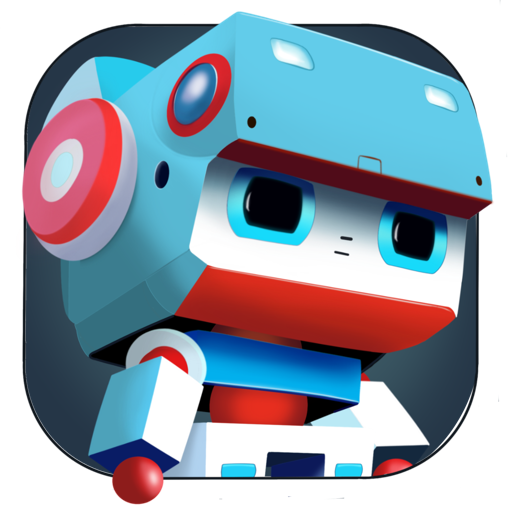

<h1 align="center">AltBot</h1>

# Your local chatbot Mac companion

AltBot is a friendly and helpful local chatbot assistant designed specifically for Mac users.

Unlike other chatbots that rely on external servers or internet connectivity, AltBot runs entirely locally on your Mac. This means local responses, improved privacy, and reduced dependence on the internet.
Whether you need assistance with simple tasks, bounce ideas, or just want to engage in friendly conversation, AltBot is here to help.

**NOTE** Line any other Large Language Model, it could provide innacurrate/misleading information. It uses mistral-7B language model as its baseline

### MAC
Run this app on devices with M1 and 8GB+ RAM, otherwise it will take a long time to respond. Apple M1 Pro or higher is recommended.

### iOS
Run this app on devices with 8GB+ RAM, otherwise it will take a long time to respond. Recommended models:
- iPhone 15 Pro
- iPad Air 5th gen or later
- iPad Pro with M1 or later

## Privacy Policy

This repository helps as a support page. If you would like to raise a concern, issue or request, sign in and create a new topic in the "Issues" tab.

Check the [Privacy Policy](PrivacyPolicy.md) if you would like to check how data is handled.

## Install

[Download on the Mac & iOS App Store](https://apps.apple.com/au/app/AltBot/id6477999764)

## Credits

This project relies on giant's shoulders thanks to their hard work:

- Georgi Gerganov and his team for [llama.cpp](https://github.com/ggerganov/llama.cpp)
- [Llama-3](https://huggingface.co/meta-llama/Meta-Llama-3-8B-Instruct) for the base model
- [QuantFactory](https://huggingface.co/QuantFactory/Meta-Llama-3-8B-Instruct-GGUF/tree/main) for the model quantization
